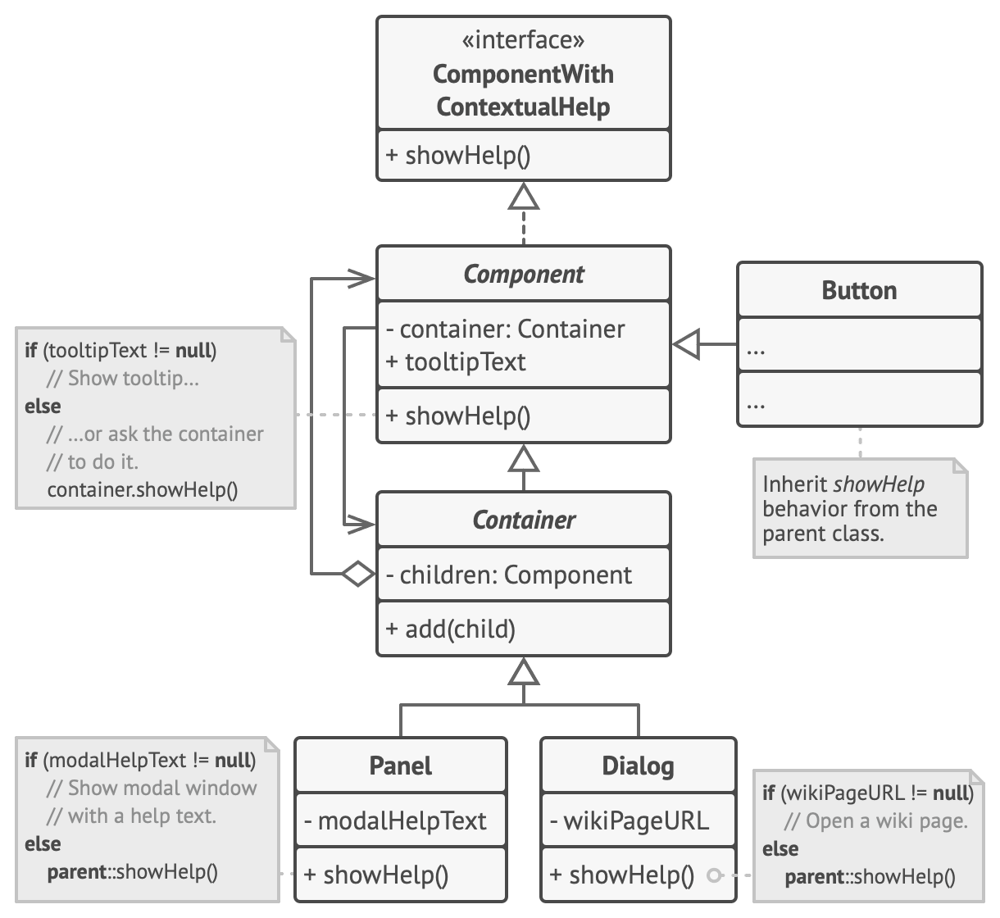

# Цепочка обязанностей

> Последовательность обработчиков, которые один за другим обрабатывают событие

[Source](https://refactoring.guru/design-patterns/chain-of-responsibility)

---

## Описание

Цепочка обязанностей (Chain of responsibility) – Цепочка компонентов, каждый из которых имеет возможность обработать
команду или запрос, при желании имеющий реализацию обработки по умолчанию и возможность завершить цепочку обработки.

**Разделение команд и запросов**:

- Команда = запрос на действие или изменение
    - например, установите значение атаки на 2
- Запрос = запрос информации
    - например, укажите значение вашей атаки
- **CQS**[^1] = наличие отдельных средств для отправки команд и запросов

---

## Мотивация

- Неэтичное поведение сотрудника; кто берет на себя вину?
    - Работник
    - Руководитель
    - Генеральный директор
- Вы щёлкаете по графическому элементу в форме
    - Кнопка обрабатывает это, останавливает дальнейшую обработку
    - Нижележащий Group Box
    - Нижележащее окно
- Компьютерная игра тип CCG
    - У существа есть значения атаки и защиты
    - Которые могут быть улучшены другими карточками

---

## Реализация

- Цепочка методов
    - [Creature](Creature.java)
- Брокерская цепочка[^2]
    - [Character](Character.java)

---

## Заключение

- Цепочка обязанностей может быть реализована как цепочка ссылок или централизованная конструкция
- Включите объекты в цепочку, по возможности контролируя их порядок

---

## Полезные ресурсы

- [Chain of Responsibility](https://refactoring.guru/design-patterns/chain-of-responsibility)
- [Broker Chain](https://cplusplus.com/forum/general/267460/)
- [Паттерн Цепочка обязанностей](https://radioprog.ru/post/1490)
- [Chain of Responsibility](https://www.oodesign.com/chain-of-responsibility-pattern/)

[^1]: CQS - Command Query Separation - Разделение команд и запросов.
[^2]: Брокерская цепочка - используемые паттерны: Цепочка обязанностей + Наблюдатель + Посредник + Снимок
