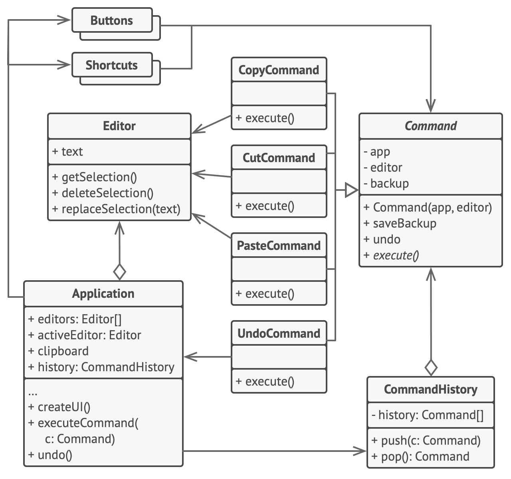

# Команда

> ТЫ НЕ ПРОЙДЁШЬ!

[Source](https://refactoring.guru/design-patterns/command)

---

## Описание

Команда (Command) – объект, представляющий собой инструкцию для выполнения определенного действия.
Содержит всю информацию, необходимую для выполнения действия.

---

## Мотивация

- Следы обычных выражений исчезают
    - Невозможно отменить присвоение значения члену
    - Невозможно напрямую сериализовать последовательность действий (вызовов)

- Вы хотите, чтобы объект представлял операцию
    - Человек должен изменить свой возраст на значение `22`
    - Машина должна исполнить `explode()` – взорваться
- Сферы использования: GUI команды, многоуровневые отмены / повторы, запись макросов и многое другое!

---

## Реализация

- [Command](Command.java)

---

## Заключение

- Инкапсулируйте все детали операции в отдельном объекте
- Определите инструкцию для применения Команды (либо в самой Команде, либо в другом месте)
- При желании определите инструкции для отмены Команды
- Можно создавать составные Команды (также известные как макросы)

---

## Полезные ресурсы

- [Command](https://refactoring.guru/design-patterns/command)
- [Паттерн Команда](https://radioprog.ru/post/1492)
- [Command Pattern](https://www.oodesign.com/command-pattern)
