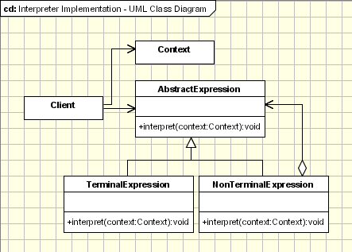

# Интерпретатор

> Интерпретаторы окружают нас повсюду. Даже сейчас, в этой самой комнате.

[Source](https://www.oodesign.com/interpreter-pattern)

---

## Описание

Интерпретатор (Interpreter) – Компонент, который обрабатывает структурированные текстовые данные, превращая их в
отдельные лексические токены (лексический анализ[^1]), а затем интерпретируя последовательности указанных
токенов (синтаксический анализ[^2]).

---

## Мотивация

- Текстовый ввод нужно обрабатывать
    - Например, превращать в структуры ООП
- Некоторые примеры
    - Компиляторы, интерпретаторы и `IDE` язык программирования
    - `HTML`, `XML` и т.п.
    - Числовые выражения `3 + 4 / 5`
    - Регулярные выражения
- Превращение строк в структуры ООП в рамках сложного процесса

---

## Реализация

- [Interpreter](Interpreter.java)

---

## Заключение

- За исключением простых случаев, Интерпретатор действует в два этапа:
    - Лексический анализ превращает текст в набор токенов
    - Разбор токенов на осмысленные конструкции
- Прошедшие синтаксический анализ данные можно обходить

---

## Полезные ресурсы

- [What is Tokenization?](https://www.geeksforgeeks.org/what-is-tokenization/)
- [Основы Natural Language Processing для текста](https://habr.com/ru/companies/Voximplant/articles/446738/)
- [Основы парсинга на Python: от Requests до Selenium](https://habr.com/ru/companies/selectel/articles/754674/)

[^1]: Токенизация (лексический анализ) - это фундаментальный процесс в обработке естественного языка
(NLP - Natural Language Processing ), который включает разбиение потока текста на более мелкие блоки,
называемые токенами. Эти токены могут варьироваться от отдельных символов до полных слов или фраз, в зависимости
от требуемого уровня детализации. Преобразуя текст в эти управляемые фрагменты, машины могут более эффективно
анализировать и понимать человеческий язык.
[^2]: Парсинг (синтаксический анализ) - это процесс сбора, обработки и анализа данных. 
