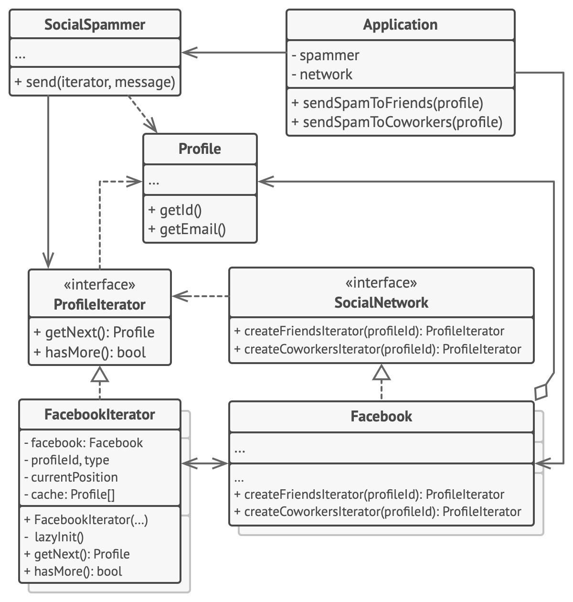

# Итератор

> Как происходит обход структур данных, и кто делает это возможным

[Source](https://refactoring.guru/design-patterns/iterator)

---

## Описание

Итератор (Iterator) – объект, облегчающий обход структуры данных.

---

## Мотивация

- Итерация (обход) – это обход основная функциональность различных структур данных
- Итератор – это класс, облегчающий обход
    - Хранит ссылку на текущий элемент
    - Знает, как перейти к другому элементу
- Протокол итератора требует:
    - `iterator()`
    - `forEach()`
    - `spliterator()`
    - 

---

## Реализация

- [BinaryTree](BinaryTree.java)
- [TreeNode](TreeNode.java)

---

## Заключение

- Итератор определяет, как можно обходить объект
- Итератор с состоянием не может быть рекурсивным

---

## Полезные ресурсы

- [Iterator](https://refactoring.guru/design-patterns/iterator)
- [Паттерн Итератор](https://radioprog.ru/post/1494)
- [Iterator Pattern](https://www.oodesign.com/iterator-pattern)
