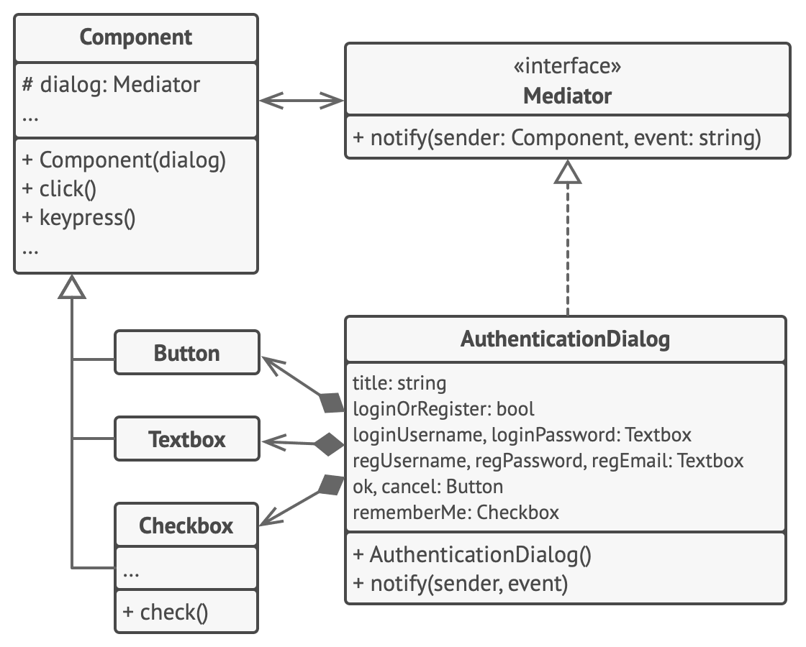

# Посредник

> Облегчает связь между компонентами

[Source](https://refactoring.guru/design-patterns/mediator)

---

## Описание

Посредник (Mediator) – компонент, который облегчает обмен данными между другими компонентами, при этом они
не обязательно знают друг о друге или имеют прямой ссылочный доступ друг к другу.

---

## Мотивация

- Компоненты могут входить и выходить из системы в любое время
    - Участники чата
    - Игроки в `MMORPG`
- Для них нет смысла иметь прямы ссылки друг на друга
    - Эти ссылки могут исчезнуть
- Решение: все должны ссылаться на какой-то центральный компонент, который облегчает коммуникацию

---

## Реализация

- [ChatRoom](ChatRoom.java)

---

## Заключение

- Создайте Посредника и пусть каждый объект в системе ссылается на него
    - Например, через атрибут
- Посредник поддерживает двустороннюю связь со своими подключенными компонентами
- У Посредника есть функции, которые могут вызывать компоненты
- Компоненты имеют функции, которые могут вызывать Посредник
- Библиотеки обработки событий (напр. `Rx`) упрощают взаимодействие

---

## Полезные ресурсы

- [Mediator](https://refactoring.guru/design-patterns/mediator)
- [Паттерн Посредник](https://radioprog.ru/post/1496)
- [Mediator Pattern](https://www.oodesign.com/mediator-pattern)
