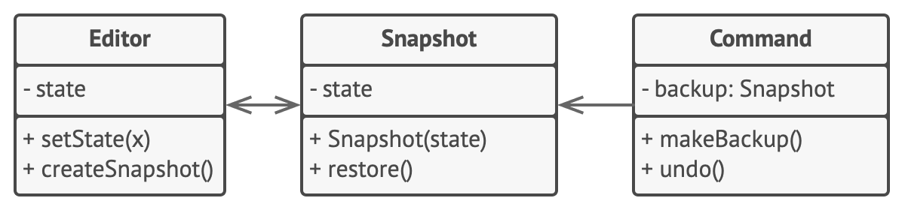

# Хранитель

> Создавайте _снимки_ состояния объекта, чтобы вернуться к этому состоянию

[Source](https://refactoring.guru/design-patterns/memento)

---

## Описание

Хранитель (Memento) – маркер / дескриптор, представляющий состояние системы. Позволяет вернуться к состоянию,
когда токен был сгенерирован. Иногда может напрямую раскрывать информацию о состоянии

---

## Мотивация

- Объект или система претерпевают изменения
    - Например, банковский счёт принимает средства или с него снимаются средства
- Есть разные способы отслеживания этих изменений
- Один из способов – записывать каждое изменение (команду) и научить команду _отменять_ себя
- Другой просто хранить снимки системы

---

## Реализация

- [BankAccountSnapshot](BankAccountSnapshot.java)

---

## Заключение

- Хранитель используются для произвольного отката состояний
- Хранитель – это просто класс токен / дескриптора, как правило без собственных функций
- От хранителя не требуется, чтобы он напрямую отображал состояние(я), в которое(ые) он возвращает систему
- Может использоваться для выполнения функций отмены / повтора

---

## Полезные ресурсы

- [Memento](https://refactoring.guru/design-patterns/memento)
- [Паттерн Снимок (Хранитель)](https://radioprog.ru/post/1498)
- [Memento Pattern](https://www.oodesign.com/memento-pattern)
