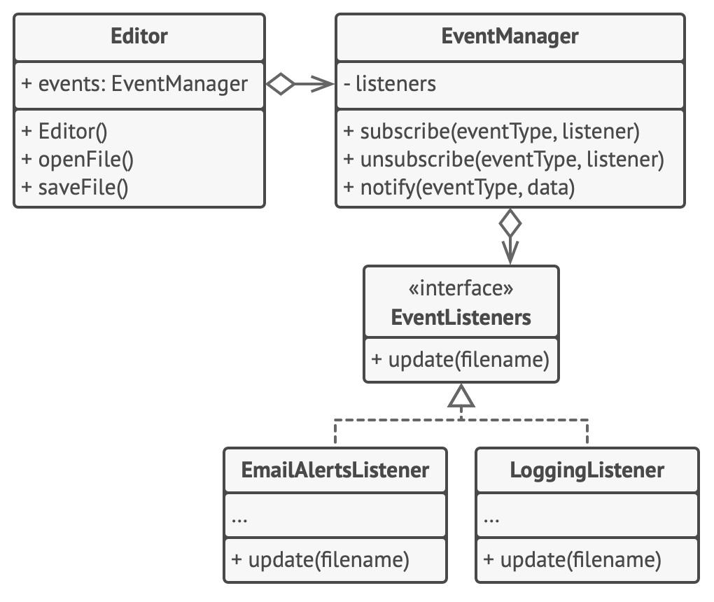

# Наблюдатель

> Я слежу за тобой!

[Source](https://refactoring.guru/design-patterns/observer)

---

## Описание

Наблюдатель (Observer) – это объект, который желает получить информацию о событиях, происходящих в системе.
Сущность, генерирующая события, является наблюдаемой.

---

## Мотивация

- Нам нужно быть в курсе, когда что-то происходит
    - Поле объекта изменяется
    - Объект что-то делает
    - Произошло какое-то внешнее событие
- Мы хотим _слушать_ события и получить уведомления, когда они происходят
- Типичный шаблон включает `addXxxListener()`
- В Java появились функциональные объекты
    - `Supplier<T>`, `Consumer<T>`, `Function<T>`

---

## Реализация

- [Rat](Rat.java)

## Заключение

- Наблюдатель – это интрузивный подход: наблюдаемый должен предоставить событие, на которое можно подписаться
- Подписка и отписка делается с помощью добавления или удаления элементов списка
- Нотификации об изменениях свойств делают легко, нотификации об изменениях зависимых свойств сложно

---

## Полезные ресурсы

- [Observer](https://refactoring.guru/design-patterns/observer)
- [Паттерн Наблюдатель](https://radioprog.ru/post/1500)
- [Observer Pattern](https://www.oodesign.com/observer-pattern)
