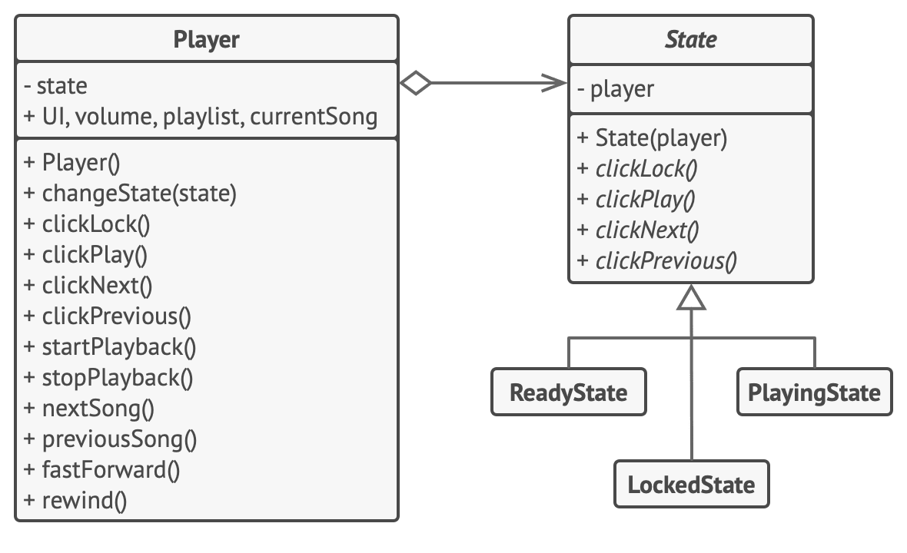

# Состояние

> Развлечение с Конечными автоматами

[Source](https://refactoring.guru/design-patterns/state)

---

## Описание

Состояние (State) – Шаблон, в котором поведение объекта определяется его состоянием. Объект переходит из одного
состояния в другое (что-то должно запускать переход).
Формализованная конструкция, которая управляет состоянием и переходами, называется Конечным автоматом.

---

## Мотивация

- Рассмотрим обычный телефон
- Что с ним делать, зависит от состояния телефонной линии
    - Если телефон звонит или вы хотите позвонить, вы можете снять трубку
    - Чтобы поговорить/позвонить, необходимо снять трубку
    - Если вы пытаетесь позвонить кому-то, а он занят, вы кладёте трубку
- Изменение в состоянии могут быть явными или в ответ на событие (шаблон [Наблюдатель](../observer/README.md))

---

## Реализация

- [Phone](Phone.java)

## Заключение

- Учитывая достаточную сложность, стоит формально определить возможные состояния и события / триггеры
- Можно определить:
    - Поведения для входа / выхода из состояния
    - Действие, когда конкретное событие вызывает переход
    - Защитные условия, разрешающие / запрещающие переход
    - Действие по умолчанию при отсутствии переходов для события

---

## Полезные ресурсы

- [State](https://refactoring.guru/design-patterns/state)
- [Паттерн Состояние](https://radioprog.ru/post/1502)
