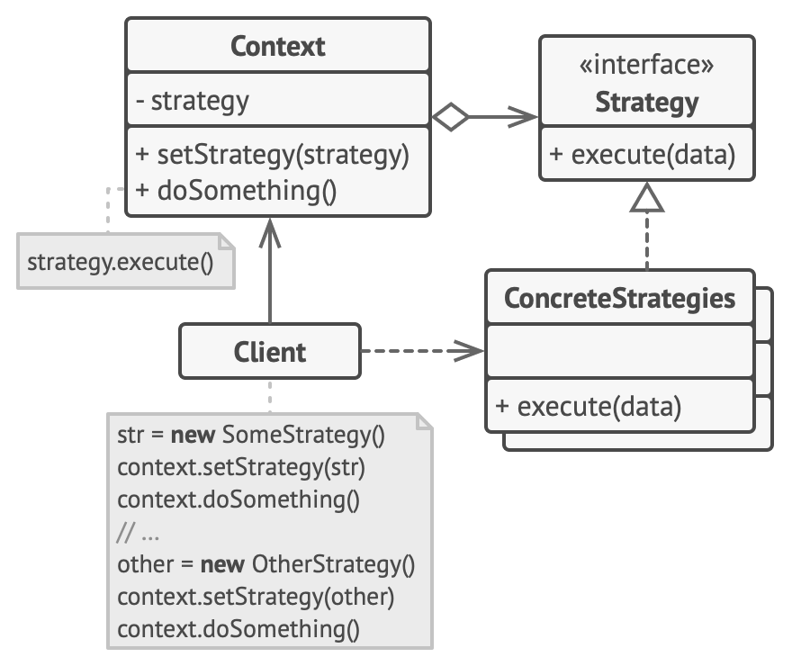

# Стратегия

> Поведение системы частично задаётся во время выполнения

[Source](https://refactoring.guru/design-patterns/strategy)

---

## Описание

Стратегия (Strategy) – Позволяет выбрать точное поведение системы либо во время выполнения (динамическое), либо во время
компиляции (статистическое).
Также известна как политика (особенно в мире `C++`).

---

## Мотивация

- Многие алгоритмы можно разложить на части более высокого и более низкого уровня
- Приготовление чая можно разложить на:
    - Процесс приготовления горячего напитка (воду вскипятить, налить в чашку); а также
    - Действия, специфические для чая (положить чайный пакетик в воду)
- Затем высокоуровневый алгоритм можно повторно использовать для приготовления кофе или горячего шоколада
    - Поддерживается стратегиями, специфичными для конкретных напитков

---

## Реализация

- [TextProcessorStatic](TextProcessorStatic.java)
- [TextProcessorDynamic](TextProcessorDynamic.java)

---

## Заключение

- Определить алгоритм на высоком уровне
- Определить интерфейс, которому вы хотите, чтобы следовала каждая Стратегия
- Обеспечьте динамическую или статистическую композицию Стратегии в общем алгоритме

---

## Полезные ресурсы

- [Strategy](https://refactoring.guru/design-patterns/strategy)
- [Паттерн Стратегия](https://radioprog.ru/post/1504)
- [Strategy Pattern](https://www.oodesign.com/strategy-pattern/)
