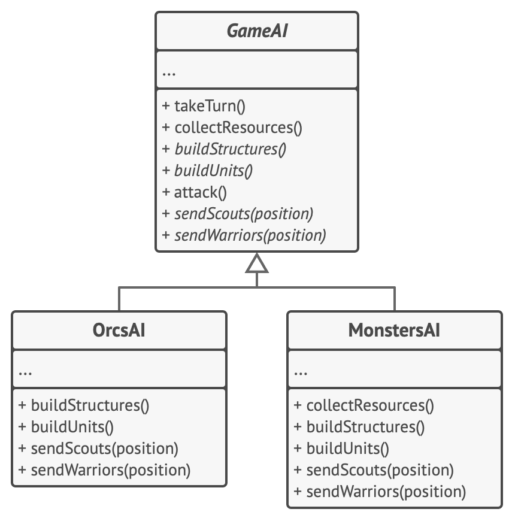

# Шаблонный метод

> Высокоуровневый план алгоритма, который должен быть завершён наследниками

[Source](https://refactoring.guru/design-patterns/template-method)

---

## Описание

Шаблонный метод (Template method) – позволяет нам определить _скелет_ алгоритма с конкретными реализациями,
определенными в подклассах.

---

## Мотивация

- Алгоритмы можно разложить на общие части и специфику
- Шаблон [Стратегия](../strategy/README.md) делает это через композицию
    - Алгоритм высокого уровня использует интерфейс
    - Конкретные реализации реализуют интерфейс
- [Шаблонный метод](#шаблонный-метод) делает то же самое через наследование
    - Общий алгоритм использует абстрактный член
    - Наследники переопределяют абстрактные члены
    - Вызывается родительский шаблонный метод

---

## Реализация

- [Chess](Chess.java)

---

## Заключение

- Определите алгоритм на высоком уровне
- Определите составные части как абстрактные методы / свойства
- Наследуйте класс алгоритма, предоставив необходимые реализации

---

## Полезные ресурсы

- [Template Method](https://refactoring.guru/design-patterns/template-method)
- [Паттерн Шаблонный метод](https://radioprog.ru/post/1506)
- [Template Method Pattern](https://www.oodesign.com/template-method-pattern)
