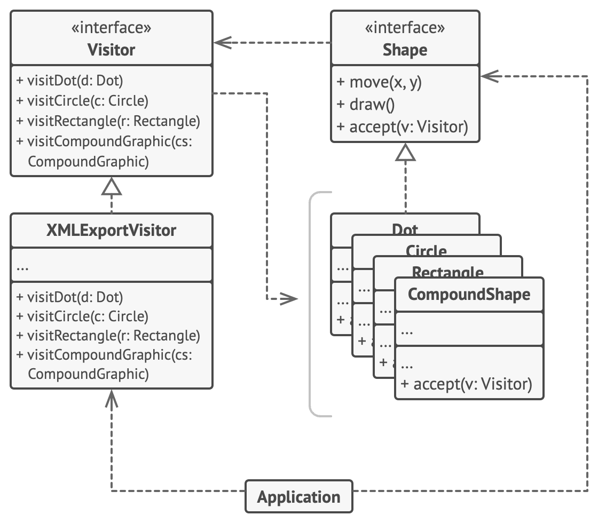

# Посетитель

> Позволяет добавлять дополнительные поведения ко всей иерархии классов

[Source](https://refactoring.guru/design-patterns/visitor)

---

## Описание

Посетитель (Visitor) – шаблон, в котором компоненту (Посетителю) разрешено проходить всю иерархию наследования.
Реализуется путем распространения одного метода `visit()` по всей иерархии

---

## Реализация

- Классическая
    - [ExpressionPrinter](ExpressionPrinter.java)
    - [ExpressionCalculator](ExpressionCalculator.java)
- Интрузивная
    - [Intrusive](intrusive/Intrusive.java)
- Рефлексивная
    - [ReflectiveExpressionPrinter](reflective/ReflectiveExpressionPrinter.java)
- Ациклическая
    - [Внешняя ссылка](https://java-design-patterns.com/patterns/acyclic-visitor/)

---

## Заключение

- Двойная диспетчеризация в стили ООП
- Вызовите `visit()` и вы обойдёте всю структуру

---

## Полезные ресурсы

- [Visitor](https://refactoring.guru/design-patterns/visitor)
- [Паттерн Посетитель](https://radioprog.ru/post/1508)
- [Visitor Pattern](https://www.oodesign.com/visitor-pattern)
- [Software design patterns, principles, and snippets](https://java-design-patterns.com/)
