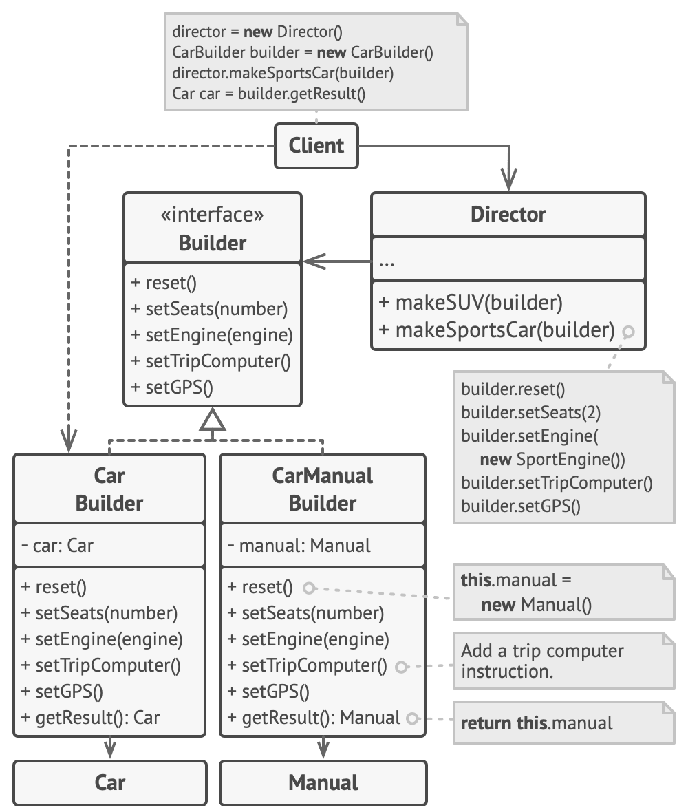

# Строитель

> Когда конструкция становится слишком сложной

[Source](https://refactoring.guru/design-patterns/builder)

---

## Описание

Строитель (Builder) – предоставляет лаконичный API для поэтапного конструирования сложного объекта

---

## Мотивация

- Некоторые объекты просты и могут быть созданы за один вызов конструктора
- Для создания других объектов требуется больше действий
- Наличие объекта с `10` аргументами в конструкторе непродуктивно
- Вместо того применяется пошаговое построение
- Строитель предоставляет API для пошагового построения объекта

---

## Реализация

1. Строитель

    - [Person](Person.java)
    - [PersonBuild](PersonBuilder.java)
    - [PersonJobBuilder](PersonJobBuilder.java)
    - [PersonAddressBuilder](PersonAddressBuilder.java)

2. Комбинирование строителей через интерфейс

    - [HtmlElement](HtmlElement.java)
    - [HtmlBuilder](HtmlBuilder.java)

---

## Заключение

- Строитель – это отдельный компонент для построения объекта
- Можно либо дать Строителю конструктор, либо вернуть его через статическую функцию
- Чтобы Строитель был текучим -> `return this`
- Различные части объекта могут быть построены разными Строителями, работающими в тандеме через базовый класс

---

## Полезные ресурсы

- [Refactoring.Guru](https://refactoring.guru/design-patterns/builder)
- [Builder Pattern](https://www.oodesign.com/builder-pattern)
