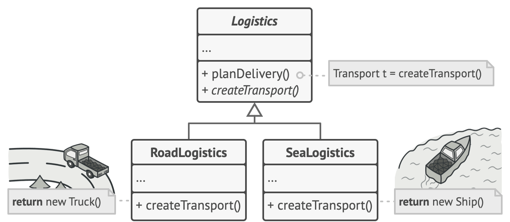
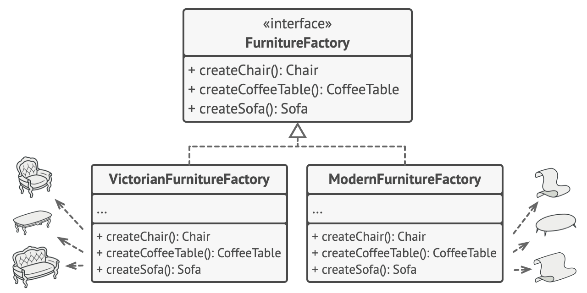

# Фабрики

> Фабричный метод и Абстрактная фабрика

- Фабричный метод

[Source](https://refactoring.guru/design-patterns/factory-method)

- Абстрактная фабрика

[Source](https://refactoring.guru/design-patterns/abstract-factory)

---

## Описание

Фабрика (Factory) – компонент, отвечающий исключительно за полное (не пошаговое) создание объектов.

---

## Мотивация

- Логика создания объекта становится слишком запутанной
- Конструктор недостаточно выразителен
    - Невозможно перегрузить одним и тем же набором аргументов с разными именами
    - Может превратиться в _"ад опциональных параметров"_
- Полное создание объекта (не пошагово, как делает Строитель (метод) можно передать на аутсорсинг
    - Отдельному методу (Фабричный метод)
    - Которых может существовать как отдельных класс (Фабрика)
    - Можно создать иерархию Фабрик с помощью Абстрактной фабрики

---

## Реализация

1. Фабричный метод

    - [CoordinateSystem](CoordinateSystem.java)
    - [Point](Point.java)

2. Фабрика

    - [PointUp](PointUp.java)
    - [Person](Person.java)

3. Абстрактная фабрика

    - [Pair](Pair.java)
    - [HotDrink](HotDrink.java)
    - [HotDrinkFactory](HotDrinkFactory.java)
    - [HotDrinkMachine](HotDrinkMachine.java)

---

## Заключение

- Фабричный метод – это статический метод, который создаёт объекты
- Фабрика – это любая сущность, которая занимается созданием объекта
- Фабрика может быть внешней либо находиться внутри объекта как внутренний класс
- Иерархии фабрик могут использоваться для создания связанных объектов

---

## Полезные ресурсы

- [Factory Pattern](https://www.oodesign.com/factory-pattern)
- [Abstract Factory](https://refactoring.guru/design-patterns/abstract-factory)
