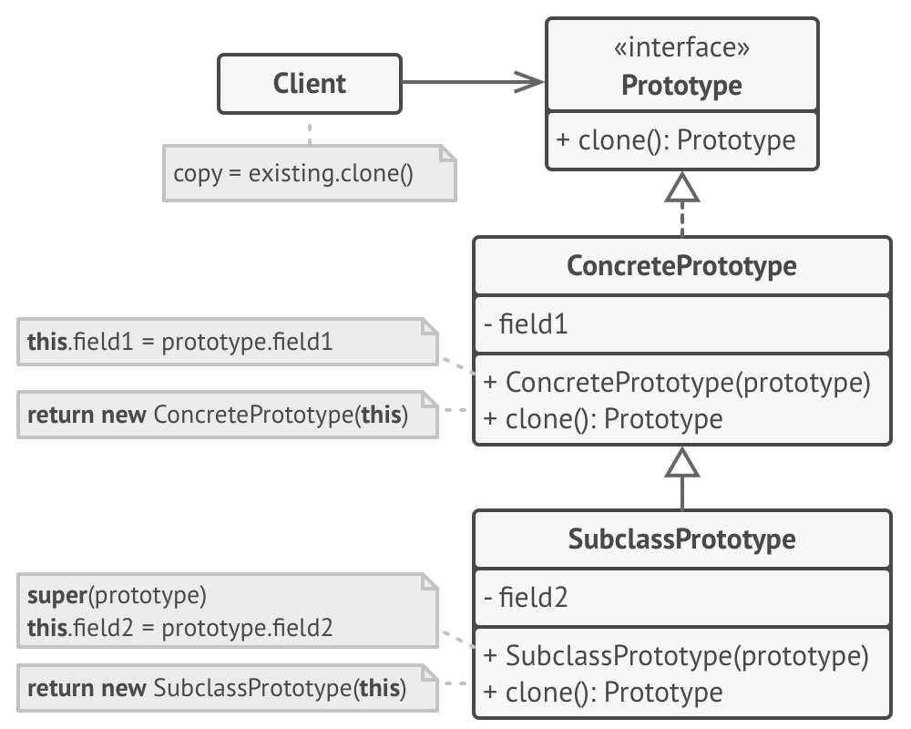

# Прототип

> Когда проще скопировать существующий объект, чтобы полностью инициализировать новый.

[Source](https://refactoring.guru/design-patterns/prototype)

---

## Описание

Прототип (Prototype) – частично или полностью инициализированный объект,
который вы копируете (клонируете) и используете.

---

## Мотивация

- Сложные объекты (например, автомобиль) не создаются с нуля
    - Они повторяют существующие конструкции
- Существующий (частично или полностью построенный) проект (класс) является Прототипом
- Мы делаем копию (клонируем) объекта-прототипа и изменяем его
    - Требуется поддержка глубокого копирования
- Мы делаем клонирование удобным (например, через Фабрики)

---

## Реализация

- [Employee](Employee.java)
- [Person](Person.java)
- [Point](Point.java)

---

## Заключение

- Чтобы реализовать Прототип, частично сконструируйте объект и сохраните его
- Сделайте глубокую копию прототипа
- Кастомизируйте получившийся экземпляр
- Фабрика предоставляет удобный API для использования прототипов

---

## Полезные ресурсы

- [Prototype](https://refactoring.guru/design-patterns/prototype)
- [Prototype Pattern](https://www.oodesign.com/prototype-pattern)
