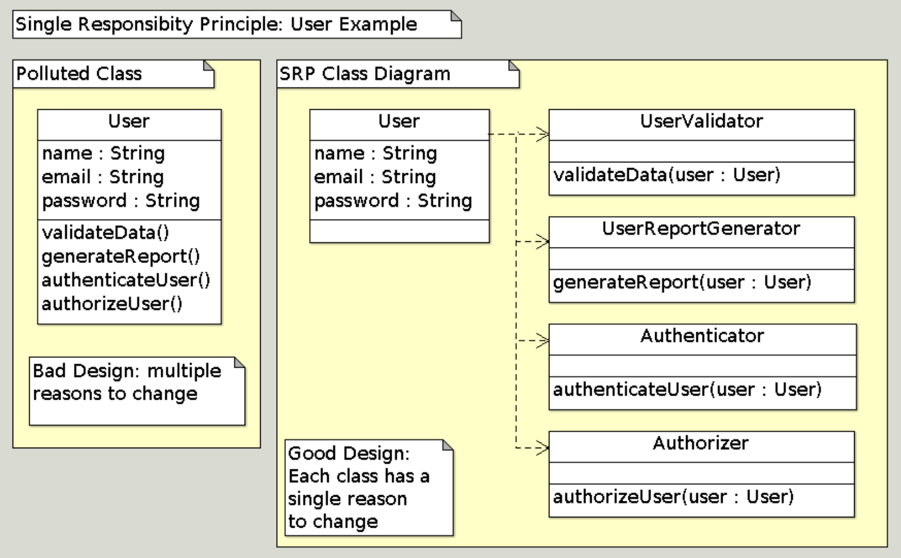
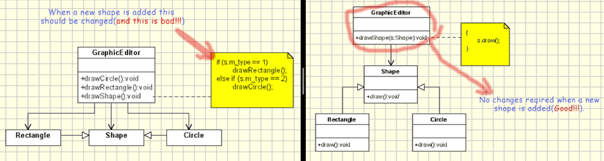
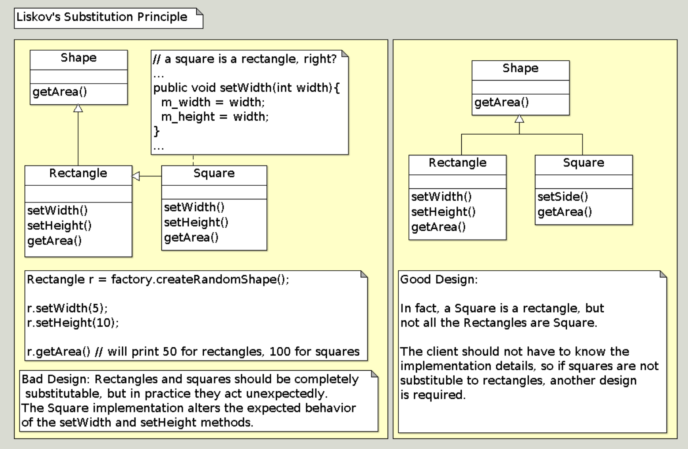
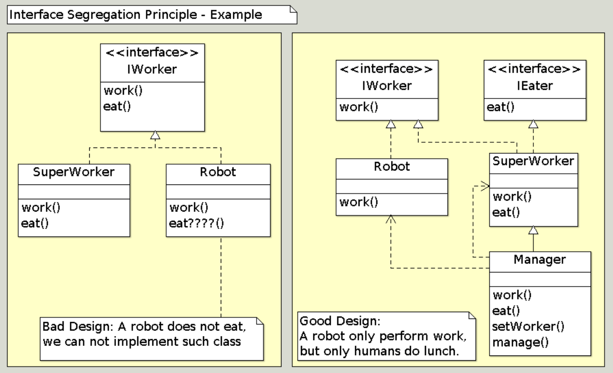
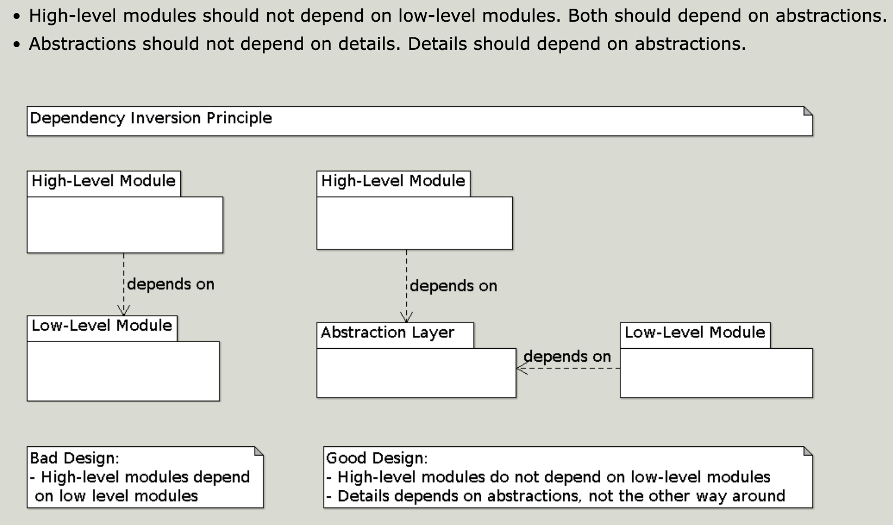

# Принципы программирования `SOLID`

Принципы дизайна, представленные Робертом Мартином (_дядя Боб_)

---

## SRP

**S**ingle Responsibility Principle | Принцип единственной ответственности

[Source](https://www.oodesign.com/single-responsibility-principle)

---

## OCP

**O**pen / Closed Principle | Принцип открытости / закрытости

[Source](https://www.oodesign.com/open-closed-principle)

---

## LSP

**L**iskov Substitution Principle | Принцип подстановки Лисков

[Source](https://www.oodesign.com/liskov-s-substitution-principle)

---

## ISP

**I**nterface Segregation Principle | Принцип разделения интерфейса

[Source](https://www.oodesign.com/interface-segregation-principle)

---

## DIP

**D**ependency Inversion Principle | Принцип инверсии зависимостей

[Source](https://www.oodesign.com/dependency-inversion-principle)

---

## РЕЗЮМЕ

- **Принцип единственной ответственности**
    - У класса должна быть только одна причина для изменения
    - Разделение ответственностей - разные классы обрабатывают разные, независимые задачи и проблемы
- **Принцип открытости / закрытости**
    - Классы должны быть открыты для расширения, но закрыты для модификации
- **Принцип подстановки Лисков**
    - Вы должны иметь возможность заменить базовый тип подтипом
- **Принцип разделения интерфейса**
    - Не помещайте слишком много в интерфейс; делите его на отдельные интерфейсы
      _"Вам это никогда не понадобится"_ (**YAGNI** - _You Ain't Going Need It_)
- **Принцип инверсии зависимостей**
    - Высокоуровневые модули не должны зависеть от низкоуровневых;
      используйте абстракции
