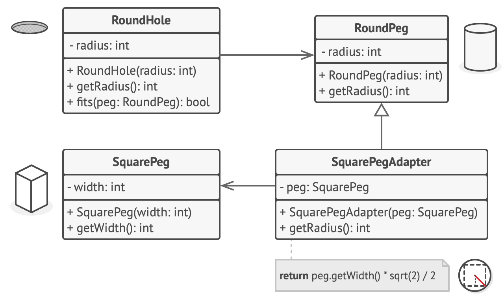

# Адаптер

> Получение желаемого интерфейса из интерфейса, который у вас есть

[Source](https://refactoring.guru/design-patterns/adapter)

---

## Описание

Адаптер (Adapter) – конструкция, которая адаптирует существующий интерфейс `X`
для соответствия требуемому интерфейсу `Y`.

---

## Пример

- Электрические устройства имеют разные требования к источнику питания (интерфейсу)
    - Напряжение (5Вт, 220Вт)
    - Тип розетки / вилки (Европа, Великобритания, США)
- Мы не можем модифицировать наши гаджеты для поддержки всех возможных интерфейсов
    - Хотя некоторая поддержка возможно (напр. 120/220Вт)
- Поэтому мы используем специальный прибор (адаптер), который предоставит нам нужный интерфейс вместо того,
  который имеется в устройстве.

---

## Реализация

- [SquareToRectangleAdapter](SquareToRectangleAdapter.java)

---

## Заключение

- Реализовать Адаптер легко
- Определите имеющийся у вас API и API, который вам нужен
- Создайте компонент, который агрегирует (содержит ссылку на) адаптируемый объект
- Промежуточные представления могут накапливаться: используйте кэширование и другие оптимизации

---

## Полезные ресурсы

- [Паттерны проектирования (GoF)](https://radioprog.ru/category/183)
- [Adapter](https://refactoring.guru/design-patterns/adapter)
- [Adapter Pattern](https://www.oodesign.com/adapter-pattern/s)
