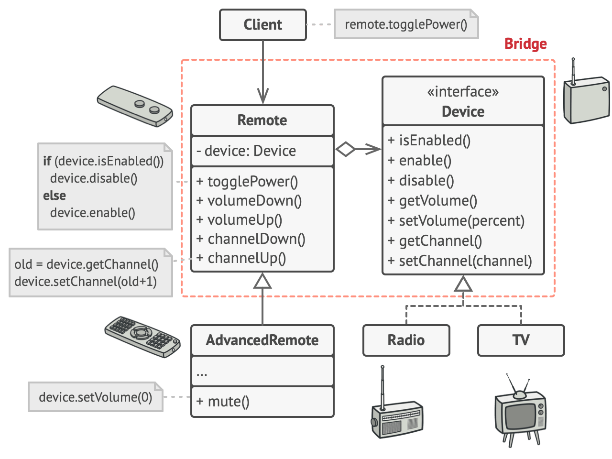

# Мост

> Соединение компонентов с помощью абстракций

[Source]()

---

## Описание

Мост (Bridge) – механизм, отделяющий интерфейс (иерархию) от реализации (иерархии).

---

## Мотивация

- Мост предотвращает взрывной рост сложности
- Пример:
    - Базовый класс `ThreadScheduler`
    - Может быть вытесняющим или кооперативным
    - Может работать в Windows или Unix
    - В итоге получается сценарий **2x2**:
        - `WindowsPTS` и `UnixPTS`
        - `WindowsCTS` и `UnixCTS`
- Шаблон Мост позволяет избежать взрывного роста сущностей

---

## Реализация

- [Circle](Circle.java)

---

## Заключение

- Отделяет абстракцию от реализации
- Оба компонента могут существовать как иерархии
- Более сильная форма инкапсуляции

---

## Полезные ресурсы

- [Bridge](https://refactoring.guru/design-patterns/bridge)
- [Bridge Pattern](https://www.oodesign.com/bridge-pattern)
