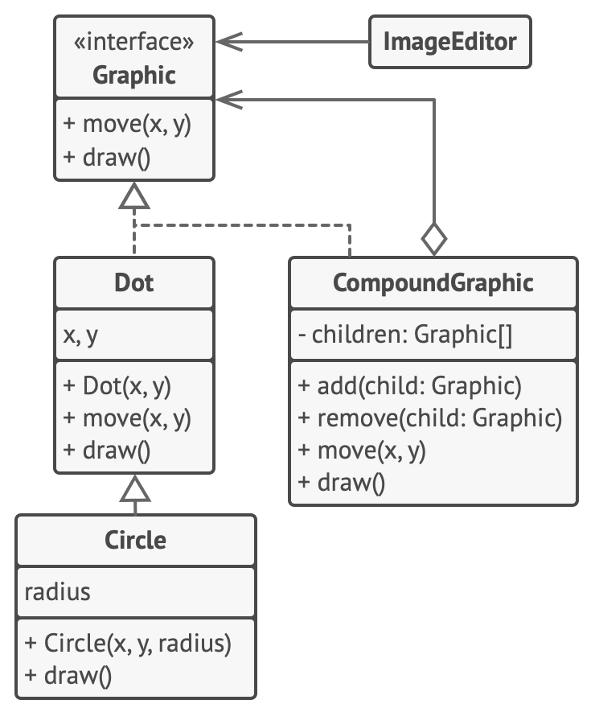

# Компоновщик

> Единообразная обработка отдельных и составных объектов

[Source](https://refactoring.guru/design-patterns/composite)

---

## Описание

Компоновщик (Composite) – механизм для единообразной обработки отдельных (скалярных) и составных объектов.

---

## Мотивация

- Объекты используют поля / методы других объектов через наследование и композицию
- Композиция позволяет создавать составные объекты
    - Например, математическое выражение, состоящее из простых выражений; или
    - Группа фигур, состоящая из нескольких различных фигур
- Компоновщик используется для единообразной обработки как одиночных (скалярных), и составных объектов
    - `Foo` и `List<Foo>` имеют общие `API`

---

## Реализация

- [Neuron](Neuron.java)
- [NeuronLayer](NeuronLayer.java)
- [SingleValue](SingleValue.java)
- [ManyValues](ManyValues.java)

---

## Заключение

- Объекты могут использовать другие объекты через наследование / композицию
- Некоторым составным и единичным объектам требуется сходная / идентичная обработка
- Компоновщик позволяет обрабатывать оба типа объектов одинаково

---

## Полезные ресурсы

- [Composite](https://refactoring.guru/design-patterns/composite)
- [Composite Pattern](https://www.oodesign.com/composite-pattern)
- [Паттерн Компоновщик](https://radioprog.ru/post/1480)
