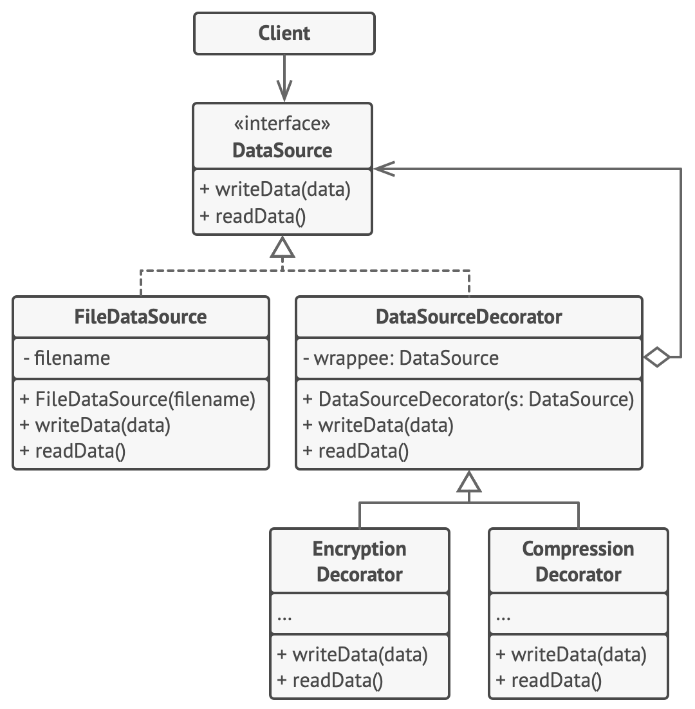

# Декоратор

> Добавление поведения без изменения самого класса

[Source](https://refactoring.guru/design-patterns/decorator)

---

## Описание

Декоратор (Decorator) – Облегчает добавление поведения к отдельным объектам без наследования от них.

---

## Мотивация

- Вы хотите расширить объект, добавив дополнительную функциональность
- Вы не хотите переписывать или изменять существующий код (принцип OCP)
- Вы хотите, чтобы новая функциональность была отделена (принцип SRP)
- Вам необходимо иметь возможность взаимодействовать с существующими структурами
- Два пути:
    - Наследовать от требуемого объекта (если возможно)
    - Создать Декоратор, который ссылается на декорированный объект(ы)

---

## Реализация

- [StaticDecorator](StaticDecorator.java)
- [DynamicDecorator](DynamicDecorator.java)

---

## Заключение

- Декоратор сохраняет ссылку на декорированный объект(ы)
- Добавляет служебные атрибуты и методы для расширения возможностей объекта
- Может или не может переадресовывать вызовы декорируемому объекту
- Проксирование базовых вызовов может выполнятся динамически

---

## Полезные ресурсы

- [Decorator](https://refactoring.guru/design-patterns/decorator)
- [Decorator Pattern](https://www.oodesign.com/decorator-pattern)
- [Паттерн Декоратор](https://radioprog.ru/post/1482)
