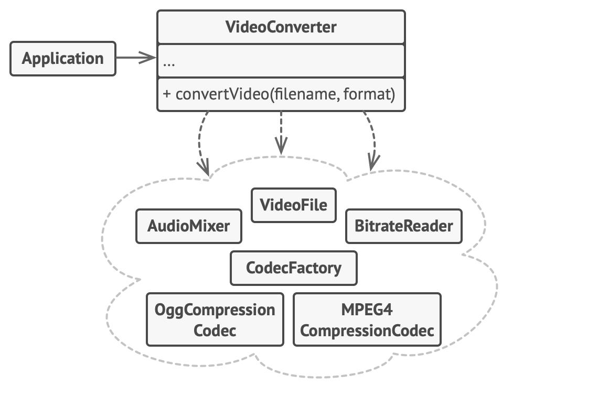

# Фасад

> Предоставление нескольких компонентов с помощью одного интерфейса.

[Source](https://refactoring.guru/design-patterns/facade)

---

## Описание

Фасад (Facade) – Предоставляет простой, лёгкий для понимания пользовательский интерфейс поверх большого и сложного кода.

---

## Мотивация

- Баланс между сложностью и удобством использования
- Типичный дом
    - Множество подсистем (электрическая, канализационная)
    - Сложная внутренняя структура (наличие этажей)
    - Конечный пользователь не имеет доступа к внутренним компонентам
- То же самое с программным обеспечением!
    - Многие системы работают, чтобы предоставить гибкость, но...
    - Пользователи API хотят, чтобы «всё просто работало»

---

## Реализация

- [Console](Console.java)

---

## Заключение

- Создайте Фасад, чтобы предоставить упрощенный API для набора классов
- Вы можете (по желанию) показать «внутреннюю кухню» через Фасад
- Можно разрешить пользователям «эскалацию», чтобы они по необходимости использовали более сложные API

---

## Полезные ресурсы

- [Facade](https://refactoring.guru/design-patterns/facade)
- [Паттерн Фасад](https://radioprog.ru/post/1484)
