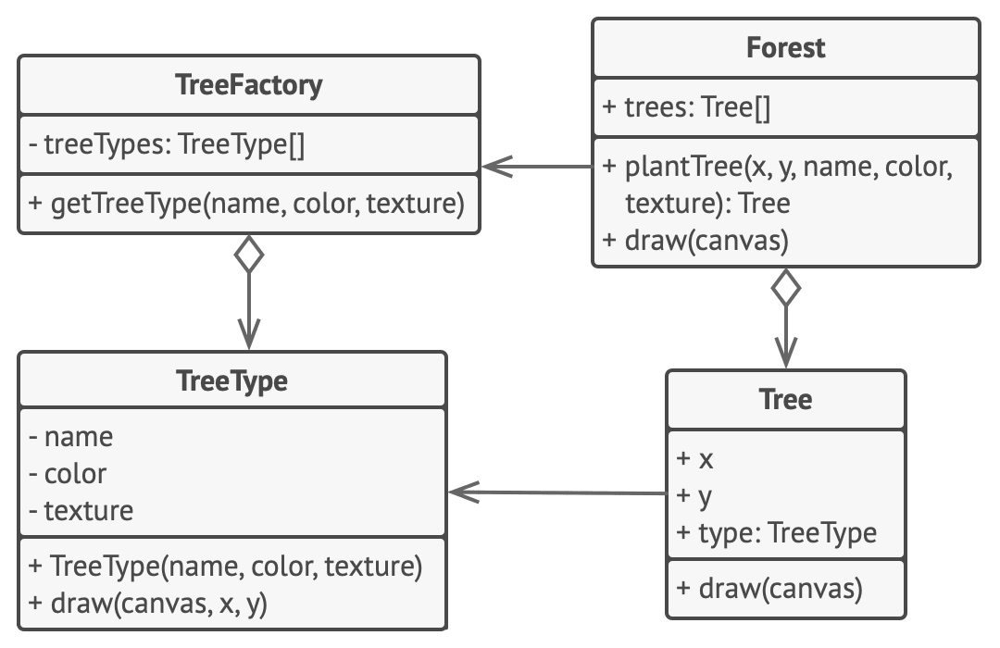

# Приспособленец

_Также этот паттерн может называться "Легковес"_

> Оптимизация пространства!

[Source](https://refactoring.guru/design-patterns/flyweight)

---

## Описание

Приспособленец (Flyweight) – метод оптимизации, который позволяет нам использовать меньше памяти за счёт
внешнего хранения данных, связанных с похожими объектами.

---

## Мотивация

- Избегаем дублирования при хранении данных
- Например, `MMORPG` (Massively Multiplayer Online Role-Playing Game)
    - Множество пользователей с одинаковыми именами / фамилиями
    - Нет смысла сохранять одно и то же имя/фамилию снова и снова
    - Вы сохраняете список имён и ссылок на них
- Например, форматирование текста полужирным или курсивном шрифтом
    - Не хотим, чтобы у каждого символа был свой символ форматирования
    - Работаем с диапазонами (например, номер строки, начальная / конечная позиции)

---

## Реализация

- [Sentence](Sentence.java)
- [UserOptimal](UserOptimal.java)

---

## Заключение

- Храним разделяемые данные вовне
- Указываем индекс или ссылку на внешнее хранилище данных
- Определяем идею «диапазонов» для однородных коллекций и храним данные, относящиеся к этим диапазонам

---

## Полезные ресурсы

- [Flyweight](https://refactoring.guru/design-patterns/flyweight)
- [Flyweight Pattern](https://www.oodesign.com/flyweight-pattern)
- [Паттерн Легковес](https://radioprog.ru/post/1486)
