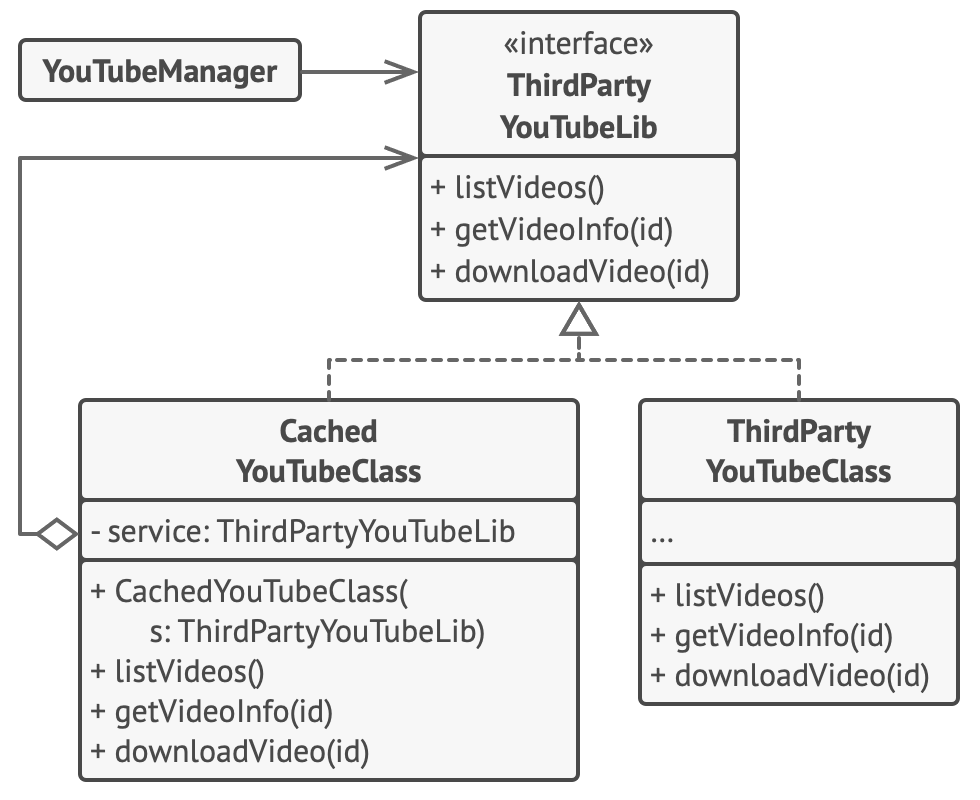

# Заместитель

> Интерфейс для доступа к определенному ресурсу

[Source](https://refactoring.guru/design-patterns/proxy)

---

## Описание

Заместитель (Proxy) – класс, который функционирует как интерфейс к определенному ресурсу.
Этот ресурс может быть удаленным, дорогостоящим в создании или может требовать логирования или
другой дополнительной функциональности.

---

## Мотивация

- Вы вызываете `foo.Bar()`
- Предполагается, что `foo` находится в том же процессе, что и `Bar()`
- Если позже вы захотите вынести все операции, связанные с `Foo` в отдельный процесс
    - Можете ли вы избежать изменения кода?
- Заместитель приходит на помощь!
    - Тот же интерфейс, совершенно другое поведение
- Это называется коммуникационный заместитель
    - Другие типы: логирующий, виртуальный, защитный…

---

## Реализация

- Защитный
    - [CarProxy](CarProxy.java)
- Виртуальный
    - [SimpleBitmap](SimpleBitmap.java)
    - [LazyBitmap](LazyBitmap.java)

---

## Заместитель vs Декоратор

- Заместитель предоставляет идентичный интерфейс
- Декоратор предоставляет расширенный интерфейс
- Декоратор как правило агрегирует (или содержит ссылку на) то, что он декорирует; Заместитель не обязательно
- Заместитель может даже работать с не материализованным объектом

---

## Заключение

- У Заместителя такой же интерфейс, что и у базового объекта
- Чтобы создать Заместителя, просто скопируйте существующий интерфейс объекта
- Добавьте соответствующую функциональность к реплицированным функциям-челнам
- Разные Заместители (коммуникационный, логирующий, кэширующий и т.д.) ведут себя совершенно по-разному

---

## Полезные ресурсы

- [Proxy](https://refactoring.guru/design-patterns/proxy)
- [Proxy Pattern](https://www.oodesign.com/proxy-pattern)
- [Паттерн Заместитель](https://radioprog.ru/post/1488)
